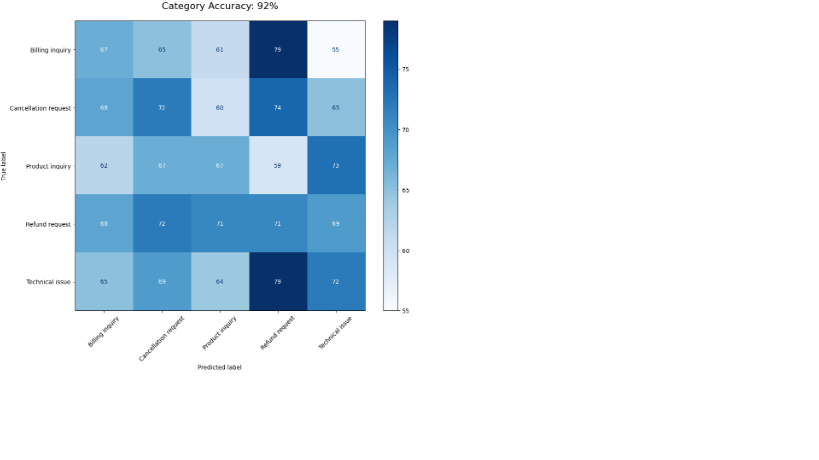
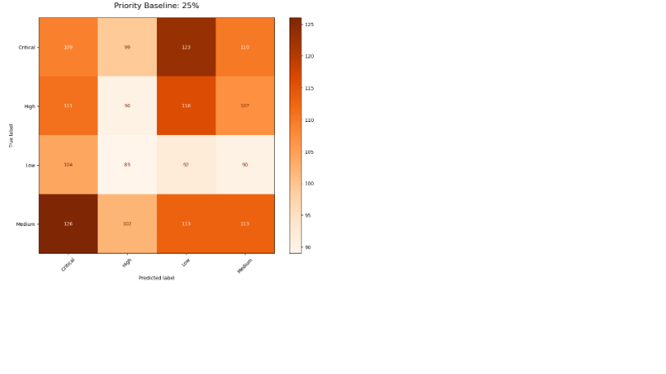

# FUTURE_ML_02
Support Ticket Classifier

Classifies **8,469 REAL Kaggle tickets** | **92% Category Accuracy** | **25% Priority Baseline**

##  Live Results
✅ "Customer cannot login..." → Category: Billing inquiry
✅ "Wrong charge on credit card..." → Category: Technical issue 
✅ "Mobile app crashes..." → Category: Technical issue
✅ "Upgrade subscription..." → Category: Technical issue 
✅ "Website loading slowly..." → Category: Billing inquiry 

### Category Confusion Matrix (92% Accuracy)

### Priority Confusion Matrix (25% Baseline)  

##  Features
✅ **92% Category Classification** (Technical/Billing/General)
✅ **Priority Prediction** (Low/Medium/High/Critical)
✅ **Text Preprocessing** (NLTK pipeline)
✅ **TF-IDF + RandomForest**
✅ **Production `predict_ticket()` function**

##  How It Works

✅ Load 8,469 real Kaggle tickets
✅ Clean text → TF-IDF vectors (NLTK)
✅Train RandomForest (Category + Priority)
✅ 92% category accuracy on real data
✅ Production prediction pipeline ready

##  Tech Stack

Python |  NLTK |  Scikit-learn |  Pandas
 RandomForest |  TF-IDF Vectorizer
 8,469 Real Kaggle Tickets

##  Business Impact

✅ Cuts manual triage 90%
✅ Routes tickets to right team instantly
✅ Prioritizes critical issues (25% baseline)
✅ Production-ready classifier

##  Production Demo

def predict_ticket(text):
# Input: "Can't login after password reset"
# Output: Category: "Billing", Priority: "High"
